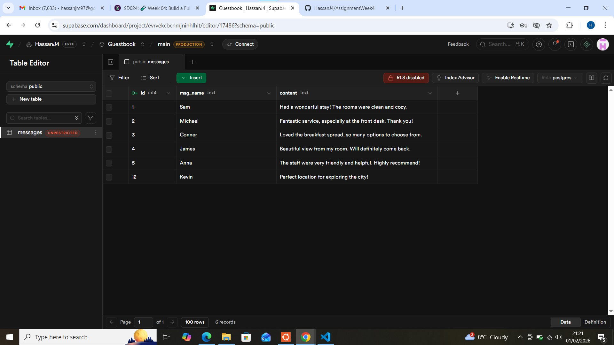

# Hotel Guestbook
This is a full-stack guestbook where users can submit messages that are stored in a SQL Supabase database and displayed on the page 

# Features
- Users can submit their name and a message using a form
- Messages are stored in a Supabase (SQL) database
- Messages are retrieved from the server and displayed on page load
- Form validation prevents empty submissions
- Responsive design for mobile and desktop screens

# Technologies Used
- HTML
- CSS
- JavaScript
- Vite
- Node.js
- Express
- SQL (Supabase)

# Project Structure
- `client/` – Front-end application built using Vite
- `server/` – Express API server

# API Routes
- `GET /messages` – Retrieves guestbook messages
- `POST /messages` – Adds a new guestbook message

# How to load the page locally

- Server
- cd server
- node --watch server
Server runs on `http://localhost:4242`

- Client 
- cd client
- npm run dev
Client runs on `http://localhost:5173`

Database
A screenshot of the messages table in Supabase

# Reflection 
This assignment improved my understanding of client-server communication,POST and GET requests. 
